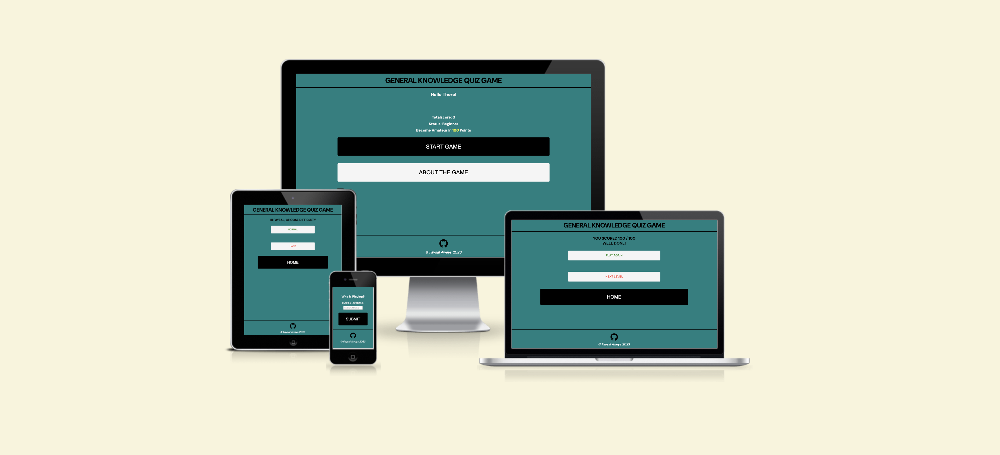

# **General Knowledge quiz game**

Quiz Game is a general knowledge quiz game that enables you to test and expand your General knowledge capacity. Quizes are a fun and entertaining way to learn while challenging yourself. Getting a question wrong and the curiosity to find the answer makes it more likely that a person will not forget the answer to a question and will remember it for a long time. Quiz Game let's you take on a the challenge to test your general knowledge capacity and teach you while you're having fun. 

[view live game.](https://faysal-ahmed-aweys.github.io/Quiz-Game/)

## **Planning Stage**

### **Target Audience:**

  * Anyone, young or grown who would like to test or expand on their general knowledge capacity. 
  * Anyone who enjoys challenges and quiz games.
  
### **User Stories:**

As a user, I would like to: 
  * See different levels of difficulty to make the game less boring, more challenging and useful while it is also fun. 
  * Have my score recorded and get a feedback at the end of each game. 
  * See the correct answer after i get a question wrong. 
  * Questions to be understandable and clear
  * See that a single game does not have too much questions. The number of questions should be short so not to make it boring and tiring.

### **Site Aims:**

1. To present a general knowledge quiz game that tests the user's general knowledge capacity.
2. To provide different levels of difficulties to make the quiz game fun and challenging. 
3. The site should be easy to navigate and instructions should be very clear.
4. To randomise questions so the questions are not the same anytime the user plays the same difficulty again.
4. To add a score counter on each game and display score feedback and text feedback on how they did at the end of the game. 
5. To add a countdown to answer each question so the user does not have time to google the answer if they don't know.
6. To become an entertaining and useful game that increases the user's general knowlegde capacity.

### **wireframes**

  * Mobile wireframes:
    * [Home page](assets/docs/wireframes/home_page_mobile.png)
    * [about game page](assets/docs/wireframes/about_the_game_mobile.png)
    * [username page](assets/docs/wireframes/username_form_page_mobile.png)
    * [difficulty page](assets/docs/wireframes/difficulty_page_mobile.png)
    * [before game countdown](assets/docs/wireframes/before_game_start_countdown_mobile.png)
    * [normal/hard games stage](assets/docs/wireframes/normal%3Ahard_game_stage_mobile.png)
    * [normal summary page](assets/docs/wireframes/normal_game_summary_page_mobile.png)
    * [hard summary page](assets/docs/wireframes/hard_game_summary_page_mobile.png)

  * desktop wireframes:
    * [Home page](assets/docs/wireframes/home_page_desktop.png)
    * [about game page](assets/docs/wireframes/about_game_desktop.png)
    * [username page](assets/docs/wireframes/username_form_desktop.png)
    * [difficulty page](assets/docs/wireframes/difficulty_page_desktop.png)
    * [before game countdown](assets/docs/wireframes/before_game_start_countdown_desktop.png)
    * [normal/hard games stage](assets/docs/wireframes/normal%3Ahard_game_stage_desktop.png)
    * [normal summary page](assets/docs/wireframes/normal_game_summary_desktop.png)
    * [hard summary page](assets/docs/wireframes/hard_game_summary_desktop.png)

### **color scheme:**
The colors used in the website were suggested to me by my sister. i like the fact that they are simple and not too colorful. I used [contrast-grid.eighshapes.com](https://contrast-grid) to make sure the colors go well together and they don't raise any contrast errors. 

### **Fonts**
I used DM sans font for my entire website and sans serif font as a backup. They are simple clean and easy to read fonts.

## **Current common Features on all pages**

### **Header**
the header has only the title of the game. I thought it was the only think necessary since i created buttons for navigation throughout the website.

#### **title**

### **Footer**
The footer has a github icon that links to my github profile and a copyright text. 

## **Individual page Features**

### **Home page**
The home page has a greeting text to greet the player after they create their username. also on the home page the players based on how much score they got can see their total score, status and the amount of points required to reach the next status. 
On the home page the players can start the game or access and know about the game by pressing the about the game button which takes them to about the game page.   

### **about the game page**
This page contains nothing more than information about the game for the players to get familiar with the game and know about its features and how it works.

### **username page**

Here, the players can create a username.This page appears only once and once a player creates a username, it is remember and will never be asked to create a username again. 

### **difficulty page**

On this page, players can choose which of the difficulty levels they want to play. Also this page contains the username as it comes after the form to improve user experience and immitate form feedback. 

### **Ready Countdown page**
This page counts down to three seconds to make sure the players are ready before the questions roll in. 

### **game stage**

#### **normal game stage**
The score is out of 100 in normal game stage. and each question should be answered in 5 seconds. 

#### **hard game stage**
The score is out of 400 in normal game stage. and each question should be answered in 10 seconds.

### **normal game summary page**

Depending on whether you get full marks or not. the text feedback changes between well done and you can do better. 

#### **full score** 

#### **not full score**

### **hard game summary page**

Depending on whether you get full marks or not. the text feedback changes between well done and you can do better.

#### **full score**

#### **not full score**

## **Future Enhancements**

In the future, I would like to add the following features. 
1. Pause feature that lets the players pause the countdown timer of the game question. This is to make the game more flexible. 
2. Feature that makes the players lose the amount of score they could get the more they delay to answer a question.
3. I would add more questions to the game.
4. Add specific knowledge categories to the game to make it more fun since some people are better at certain things than others. 

## **Testing**

### **Manual testing**

I and some people including my sister and my friend who i mentioned in the credits section have tested my game during development and after development. One of the issues and the most troublesome was the question timer glitching each time the level is played again or next level is clicked. The reason for this was that i was used different pages for difficulty and summary. What i did to fix was use the same page buttons for difficulty and summary then the level would be started again and question timer reset. 

### **Unfixed bugs**
* some times the same question is shown in the same game. 
* if the player gains some score and decided to reload the page midgame before finishing that game level, then his totalscore is updated. 

### **Validator testing**

#### **HTML**

I used my website link to test my HTML and i got no errors or warning.

[HTML Validator link](https://validator.w3.org/nu/?doc=https%3A%2F%2Ffaysal-ahmed-aweys.github.io%2FQuiz-Game%2F)

#### **CSS**

I used my website link to test my CSS and i got no errors or warning.

[CSS Validator link](https://jigsaw.w3.org/css-validator/validator?uri=https%3A%2F%2Ffaysal-ahmed-aweys.github.io%2FQuiz-Game&profile=css3svg&usermedium=all&warning=1&vextwarning=&lang=en)

#### **JavaScript**

I copied my JS code and tested using JSHint and i got undefined and unused variables. 

I removed the unsued variables and got tested again. The reason why it still shows the undefined variables is because they are arrow functions and whether i used let or const to define or not, it still showed the same. I could not define it using 

### **lighthouse testing**

I did lighthouse test by inspecting my website on google chrome. i got these results at first. 

I fixed contrast errors and added meta tags on my website to get better results. 

### **accessibility testing**

No errors or contrast errors were returned by using [WAVE - Web accessibility evaluation tool](https://wave.webaim.org/) to test accessibility of my web pages.

| User Story                                                                            | Expected Result                                                                                                                           | Pass    |
|---------------------------------------------------------------------------------------|-------------------------------------------------------------------------------------------------------------------------------------------|---------|
| See different levels of difficulty to make the game less boring, more challenging and useful while it is also fun.                                                 | The game has two levels of difficulty. Normal and hard. Normal level is easier and hard level challenging.                                                                     | &check; |
| Have my score recorded and get a feedback at the end of each game. | The game records how much score the player gets in each game and displays a summary page at the end to show how the player did.                              | &check; |
| See the correct answer after i get a question wrong.             | The correct answer is displayed with green color and the wrong answer is displayed with a red color                                                                                           | &check; |
|Questions to be understandable and clear  | Questions are clear and understandable and they are multiple choice type of questions since it is a quiz game.                                                                                        | &check; |
| See that a single game does not have too much questions. The number of questions should be short so not to make it boring and tiring.                                    | Normal level game has 5 questions and hard level game has 10 questions. they are which are not too much and less boring and tiring to play.                                    | &check; |

## **Deployment**

Following advice from walthrough projects of Code isntitute web development course and my mentor, David Bowers, i Deployed my website early.

I deployed my website on github pages with these steps:

1. I clicked on the settings on my repository.
2. From the menu on the left, I clicked on pages.
3. under source, i selected "deploy from a branch" and under branch, i selected "main" branch and the root folder. Then i clicked save.
4. The website was deployed and can be found under deployments on the right menu of the repository.

Here is the link to my live website [Quiz Game](https://faysal-ahmed-aweys.github.io/Quiz-Game)

## **Credits**

### **honourable mentions**

I would like to thank my mentor David Bowers. He has been of a great help throughout the course of my project. I would like to thank him for introducing me to JS Hint.

I would like to thank my sister Maryan Aweys who has helped me with choosing colors and designing my website.

I would like to thank my 8 years old nephew. He likes playing games and through his infinite experience of playing games, he gave me the idea of using total score and status names.

I would like to thank my sister Aliya Aweys and my friend Abdurahman Yusuf for testing my game and raising feedback. 

### **General reference** 
These youtube videos have helped me a lot in making the quiz game.
* [Youtube video one ](https://youtu.be/PBcqGxrr9g8?si=fuu4ttNZ60S6GDsh)
* [Youtube video two](https://youtu.be/f4fB9Xg2JEY?si=du4OSQlcXVaEj1x4)
* [youtube video three](https://youtu.be/riDzcEQbX6k?si=q41qfzlIte6UbADI)

### **Content**
* The social icon in the footer are from [Font Awesome](https://fontawesome.com/)
* I used [WAVE - Web accessibility evaluation tool](https://wave.webaim.org/) to check accesibility of the web pages.
* i used [amiresponsive](https://ui.dev/) to check responsiveness of my website.
* I got normal questions from [games4real.com](games4real.com)
* I got hard questions from [kwizzbit.com](kwizzbit.com)

### **Media and design**
* I created the favicon using [favicon.io](https://favicon.io/)
* I used [Balsamiq](https://balsamiq.com/) to create Wireframes.
* fonts used are from [Google Fonts](https://fonts.google.com/).
* i used [iloveimg](https://www.iloveimg/) to crop screenshots.
* i used [contrast-grid.eighshapes.com](https://contrast-grid.eightshapes.com/) to check contast of colors used in the website. 

